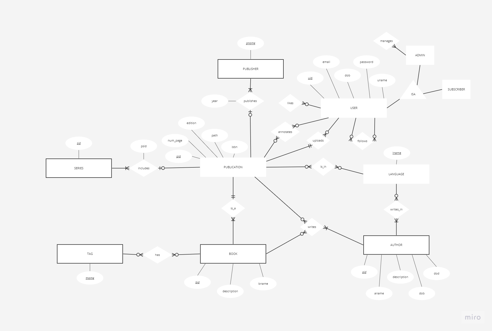

## Project Goal Summary

The aim is to develop a comprehensive **Digital Library Platform** with enhanced functionalities to support a dynamic bookshelf experience, facilitate user interaction, and improve content accessibility.

### Core Objectives

#### 1. **DBMS for Book Management**
- **Objective:** Implement a robust Database Management System (DBMS) for efficient organization, storage, and retrieval of digital content.
- **Features:**
  - Categorization and indexing of books.
  - Advanced search functionality based on metadata.

#### 2. **User Account Management**
- **Objective:** Facilitate a multi-user environment with personalized profiles.
- **Features:**
  - Personalized dashboards.
  - Content upload and management capabilities.

#### 3. **Content Upload and Management**
- **Objective:** Enable document upload, with a focus on PDF formats, to enrich the library's offerings.
- **Features:**
  - Support for OCR processing of image-based PDFs.
  - Conversion of scanned documents to searchable text formats.

#### 4. **Integration of OCR Technology**
- **Objective:** Leverage OCR technology for converting non-searchable, image-based PDFs into searchable and accessible formats.
- **Technology:** Utilization of PyTesseract or similar OCR tools for text extraction.

#### 5. **Integration with ChatGPT for Metadata Search**
- **Objective:** Implement ChatGPT or similar AI technologies to assist users in searching for book metadata.
- **Features:**
  - Natural language processing for improved search results.
  - Enhanced interaction with digital content through AI-driven queries.

#### 6. **Personalized Annotation**
- **Objective:** Provide functionality for users to create and save personal annotations within eBooks.
- **Features:**
  - User-specific notes and highlights.
  - Cross-device accessibility of saved annotations.

### Tech Stack

#### Frontend

- **Vue.js**: A progressive JavaScript framework for building user interfaces. Its ecosystem includes:
- **Vue Router** for client-side routing.

#### Backend

- **Python**: Serving as the backend programming language with its vast library support and community. Framework options include:
  - **Flask**: A lightweight WSGI web application framework, ideal for building RESTful APIs with a minimalistic approach.

#### Database

- **PostgreSQL**: An open-source relational database system, chosen for its advanced features and reliability. It provides robust support for complex queries and transactions.

#### OCR Integration

- **PyTesseract**: A Python library serving as a wrapper for Google’s Tesseract-OCR Engine, used for converting image-based PDFs to searchable text.

#### AI Integration

- **OpenAI API**: For integrating AI-driven functionalities like metadata search through natural language processing, enhancing user interaction, and content discovery.

#### Server

- **Apache HTTP Server**: Selected for serving the web content. Apache provides robust, scalable, and secure options for web server deployment.

#### Additional Tools and Services

- **Docker**: For containerizing the application, ensuring consistency across different development and production environments.
- **Git**: For version control, using GitHub for repository hosting.

#### Hosting/Deployment

- **AWS EC2**: Chosen for its flexibility, scalability, and control, EC2 instances will host the application, offering a reliable cloud computing environment.

#### Development Tools

- **Visual Studio Code**: Recommended IDEs for Vue.js and Python development.
- **Postman**: For testing and developing APIs.

## Database Structure

