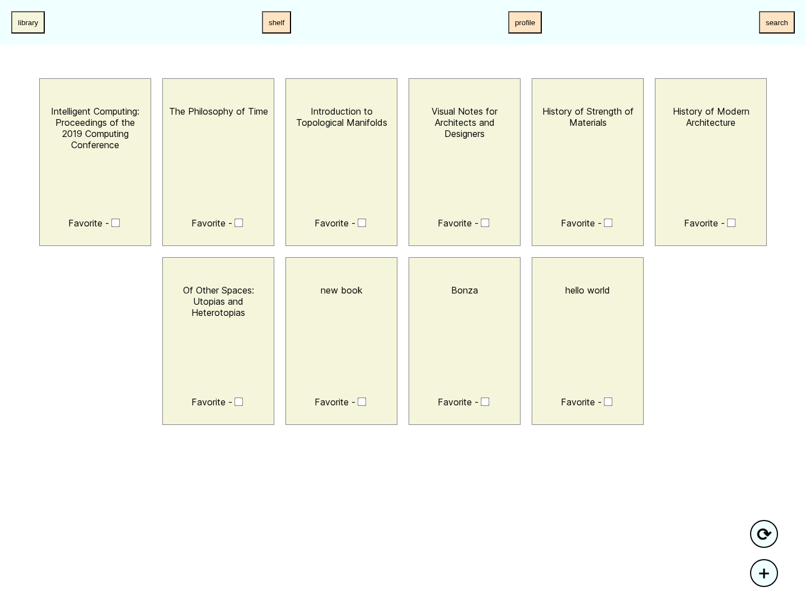
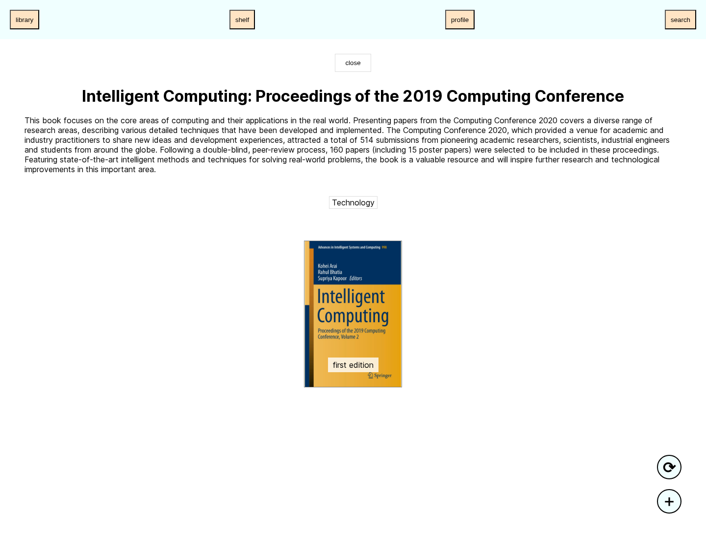
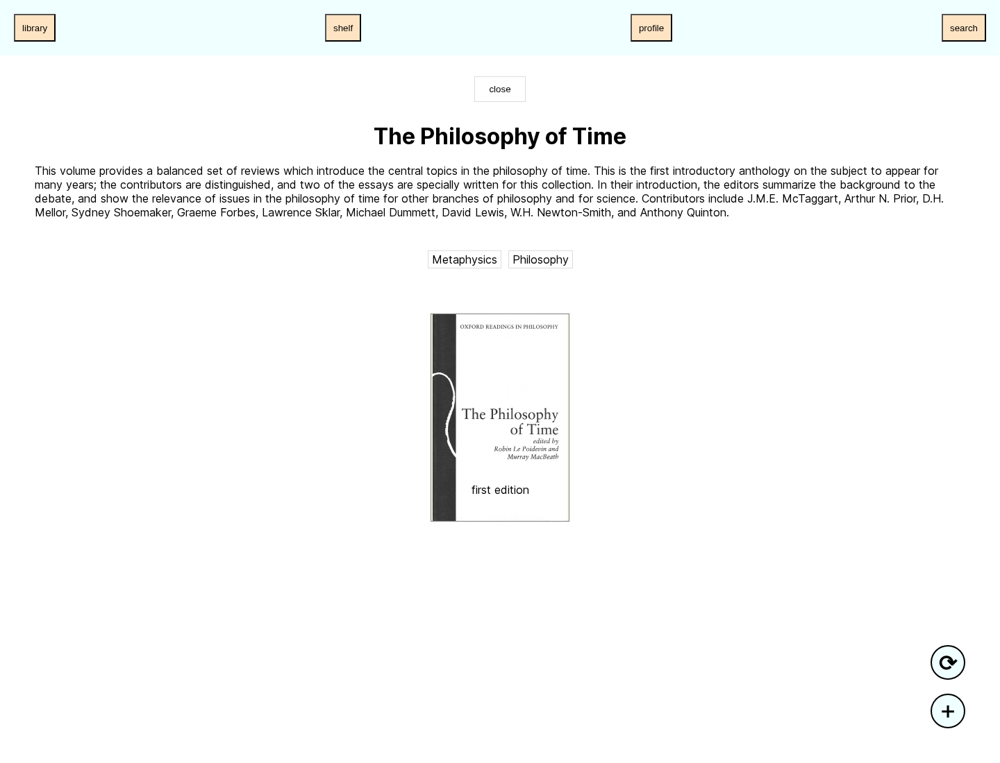
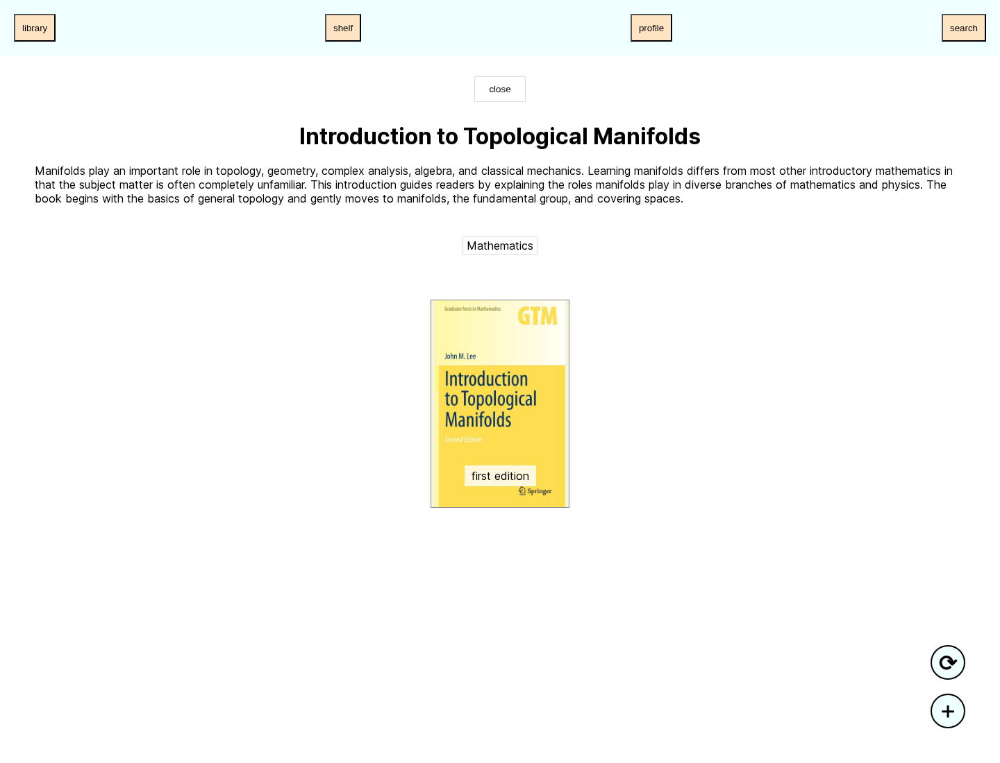
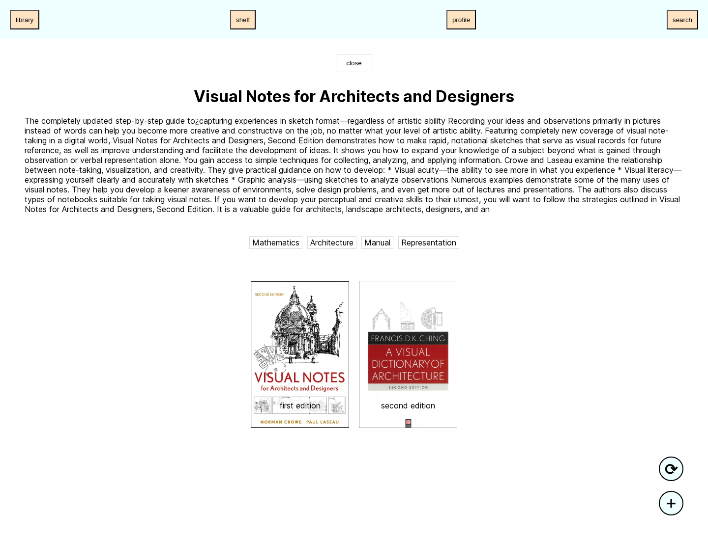
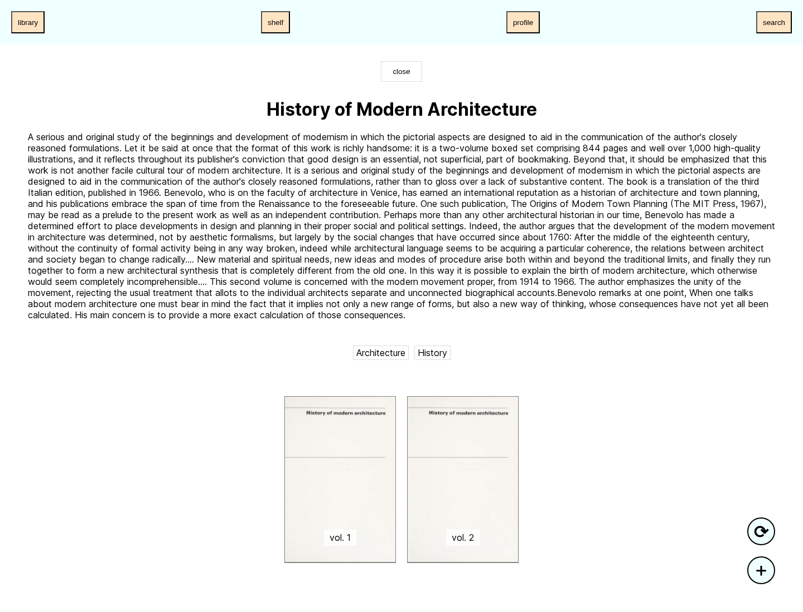
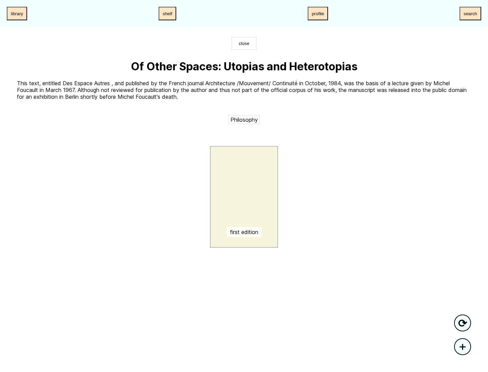

### GROUP NAME

DB.**jar**

### GROUP MEMBERS

**J**effrey Wong  
**A**nnie He  
**R**icky Cui

### MEMBER EMAILS

- annie.he@cooper.edu
- jeffrey.wong@cooper.edu
- ricky.cui@cooper.edu

### PROJECT NAME

SQLib: Solid Quality Library

### DESCRIPTION

A platform similar to libgen where users can upload their favorite books and discover new titles from other users.

### SCREENSHOTS
















### SETUP

In databases repo rood directory:
```bash
./docker.sh
./docker.sh app
  npm install
  npx prisma generate
  npx prisma migrate deploy
  npx prisma db seed
  exit
cd next
npm run dev
```
Note that `npm install` and `npx prisma generate` only need to be run once.

To restore a database dump after the containers are running:
```bash
cat db-snapshot.sql | sudo docker exec -i sqlib-db-1 psql -v ON_ERROR_STOP=1 -U annie -d lib
```
`cat db-snapshot.sql` reads the dump file, `|` pipes it into Docker, `docker exec -i sqlib-db-1` runs the restore inside the database container, `psql` is the PostgreSQL client, `ON_ERROR_STOP=1` stops on restore errors, `-U annie` selects the database user, and `-d lib` selects the database.

### TECH STACK

- **Next.js**: fullstack framework.
- **Prisma**: ORM for Node.js.
- **PostgreSQL**: relational database.

  #### Additional Tools

- **Docker**: containerization.
- **Git**: version control.

  #### To be implemented

- **AWS EC2/ECS**: cloud hosting.
- **Apache/Nginx**?: serving.

### DATABASE MODELS

`next/prisma/schema.prisma`
